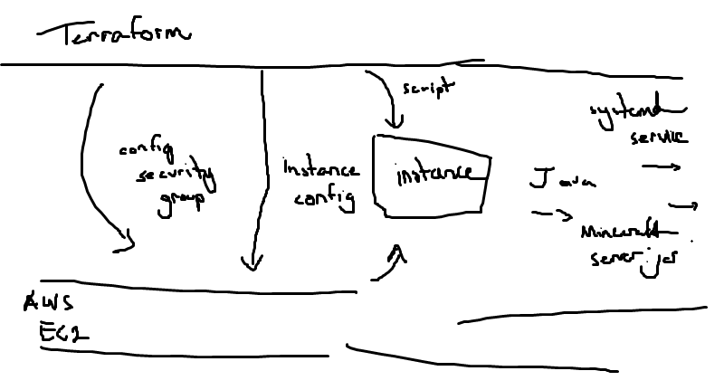

# Background
For this project, we are tasked with fully automating the provisioning, configurating, and setup of our Minecraft server with using the tools that we learned from class (Ansible, Terraform, Pulumi, Docker, Scripting, GitHub Actions, etc.).

This project was implemented using Terraform, AWS CLI, and an AWS account.
# Diagram of pipeline procedure


# Prerequisites
- AWS account
- AWS CLI
- Terraform
- Command-line shell (powershell, bash, etc.)

# Install necessary tools
- Install the Terraform CLI: [Install Teraform | Terraform | HashiCorp Developer](https://developer.hashicorp.com/terraform/tutorials/aws-get-started/install-cli)
- Install the AWS CLI: [Installing or updating the latest version of the AWS CLI - AWS Command Line Interface (amazon.com)](https://docs.aws.amazon.com/cli/latest/userguide/getting-started-install.html)

# User configurations
## AWS CLI Credentials & Environment Variables
To use the pipeline, you must configure your AWS CLI credentials. With your AWS account, on the page in which you can start a lab session, click on "AWS details". This will pull up important credentials such as the AWS access key id, secret key, and session token. Copy and paste this information into a file with the path `~/.aws/credentials` (if the folder/file doesn't exist, you'll have to make it!). You might need to configure `minecraft.tf` so that the provider handler has the correct path to these files ```"C:\\Users\\<yourusername>\\.aws\\credentials``` or 

Alternatively, these can be configured by using the `aws configure` command in your shell terminal. For example,
``` aws configure set "<variable>" "<value>"``` (repeat for the each of the three variables)
where you replace the <value> and <variable> for the corresponding AWS CLI information.
  
## AWS Key Pair
In order to connect to the server, you will be needing a key pair. To create a key pair, go to the AWS dashboard, and search for "key pairs" in the search bar. Check to make sure you're in the create region (us-east-1) and click "Create key pair", name the key pair "minecraft", and have its format be `.pem`. 

# Important commands
The important commands are all located from within the `script.sh` file
```terraform init``` - this will initialize the directory that holds the new/existing configuration
```terraform fmt``` - this will format the configuration. If your configuration file was formatted correctly, Terraform will not return any file names.
```terraform validate``` - this will validate the configuration.
```terraform apply -auto-approve``` - this will apply the configuration plan. It will also automatically accept any plan when Terraform normally pauses and waits for user approval.
```terraform output``` will output any output described in the configuration script to the terminal. In this case, it will output the public IP address of the minecraft server instance.

# Usage
From your local machine, open up your terminal and clone this repository using the command:
```use git clone https://github.com/StevenHVu/System-Administration-Final-Project.git```
  
From there, change directories (using `cd` command) to the GitHub repo (you should see a file named 'minecraft.tf' when you check the directory's contents). Then, simply run the following command:
```./script.sh```
After the script is done, enter the command: ```terraform output``` to see the IP address of the Minecraft server instance. Next, open up your Minecraft game, go to Multiplayer, click on "Add server", and in the server address, paste the public IP address into there, and click "Save". After about five minutes, the server should be up and you should be able to join the server!
  
After you are done with Minecraft, you can destroy the instance with the following command:
```terraform destroy```
enter "yes" when prompted, and the server will be gone, obliterated, reduced to atoms...
  
# Resources used
- ChatGPT - May 24th Version
- https://docs.aws.amazon.com/AWSEC2/latest/UserGuide/finding-an-ami.html
- https://developer.hashicorp.com/terraform/tutorials/aws-get-started/install-cli
- https://github.com/HarryNash/terraform-minecraft
